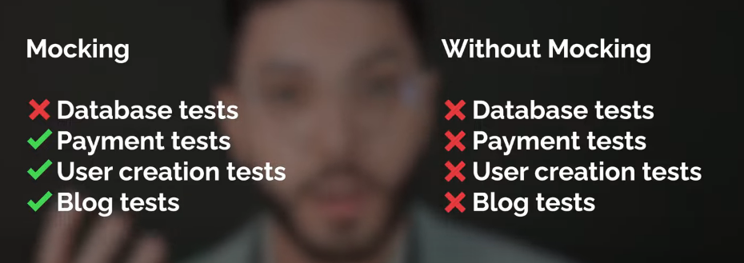

# what is mocking
Mocking is creating a fake instance of a object or dependency for us to test on

# Example of Mocking
testing a function that is operating on a database (requires a database) , it would be inefficent
to setup an actual database just to run tests on it. Remember we are ultimately TESTING the FUNCTION. not the database.

# Pros of Mocking
Mocking is useful as it is definitely faster, uses less resources , does not require cleanup, and tests will STILL pass if 
the actual database breaks.

# Cons of Mocking
the con is the confidence level. Sometimes the fake environment is definitely not a perfect indicator of real environment

# Mocking VS Real tests
so is fast mocked test better? or slow,rest end-to-end test?
We should use both depending on the situation.

if the situation requires immediate feedback, we use mock data and mock interactions
maybe into the actualy pipeline deployment, we use real data and mock interactions

# Follow-up
To my future self :
im still quite lost on the part of ConfigurableSleeper and beyond. 